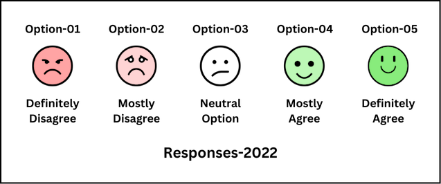
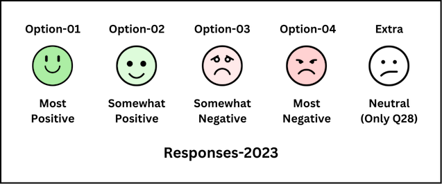
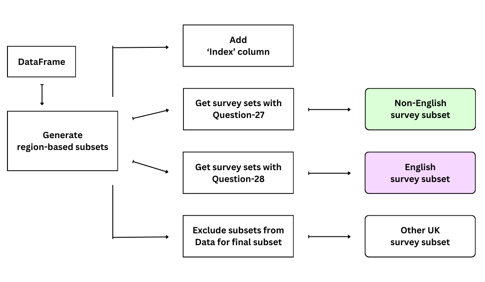
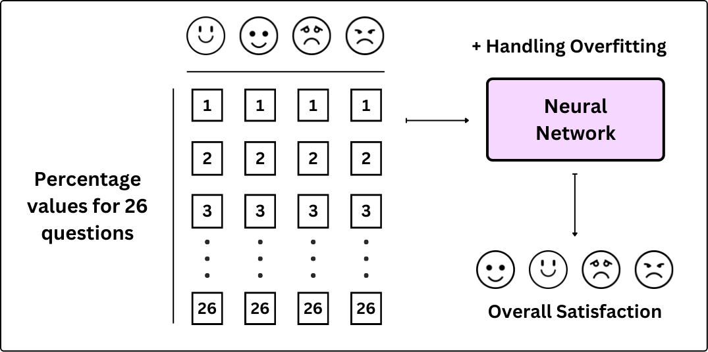

## Digital Twin for UK's National Student Survey (NSS)

Dissertation for Master's course focused on building AI Digital Twins for the National Student Survey data. The project accommodates changes in the survey format while also understanding difference in student responses across countries. Highlights data understanding & operations along with knowledge of AI methods and extensive research. The resulting Digital Twins simulate the student satisfaction measure (Positivity) which can substantially aid universities in making informed decisions regarding course related matters. Links : [Gallery](https://drive.google.com/drive/folders/1ZONnV8QwZ9UPhBQxoD5NivTGvpyhjIBU) / [Report](https://drive.google.com/file/d/1pIaSQeuwMIr7kaisAWjHednSJOwUdvVQ/view)

#### About the NSS Datasets :
  - Anonymized datasets containing survey results, released yearly by the Office of Students (OfS)
  - Comes in three levels of course aggregation  `(CAH07, CAH07-01, CAH07-01-02)`
  - Survey questions are grouped in scales `(2022 data)` and themes `(2023 data)`
  - The questions have different response options `(view first image)` in the two sets
  - Columns for providers, subject, survey, and questions are present `(view table below)`

Category | Column | Description
-- | -- | --
Provider | UKPRN | Unique reference for providers
  || Provider Name | Name of the provider
Subject | Subject code | Common Aggregate Hierarchy (CAH) code
  || Subject | Name of the subject
Survey | Population | # eligble students
  || Responses | # students that responded
Question | Qn Text | Number and Text for questions on the survey
  || Option 1 | # students that opted option-1
  || Option 2 | # students that opted option-2
  || Option 3 | # students that opted option-3
  || Option 4 | # students that opted option-4
  || Option 5 | # students that opted option-5 (Only for Q28)
Positivity | Positivity | % positive responses for particular question

#### NSS Survey changes :

The Office for Students (OfS) and the UK funding and regulatory bodies began a two-stage review of the NSS in 2020 with an aim to ensure the NSS remains fit for purpose and con- tinues to support regulation and student information across the UK. The entire review process lasted 2 years and by the end of 2022, a consultation was published seeking the stakeholders’ views on the proposed changes. Later in that year, the OfS published the final decisions on changes and informed students that the use of the new format would begin in 2023’s survey.

  1) After the review, it was decided that the question on 'overall satisfaction' will no longer be asked for English students but will still be included in Scotland, Wales, and Northern Ireland as the funding bodies decided to retain the measure for regulatory purposes.

  2) In the new survey format, the response scale was replaced with a 4-point system dropping the Neutral option for all questions except the one on Overall Satisfaction for students in Scotland, Wales, and Northern Ireland.

  3) The review also resulted in the decision of adding 2 new questions to the survey. One on mental well-being services (asked all over the UK), and the other on Freedom of Expression (asked only in England).

#### Testing multiple models :
- Using 2022 data (with true values), multiple CNN models were tested to predict positivity scores
- Model performance was assessed each time with Rsquared values, Residuals, and Loss curves
- Batch Normalization and Dropout layers were included between layers to avoid overfitting
- The best performing model (on 2022 data) was then saved and tested over processed 2023 data
- Non-english sets in 2023 data (with positivity) were used to train best performing model again
- Freshly trained model was used to predict missing positivity scores for English subsets
- Once all sets had positivity measures, English & Non-English sets were combined & re-shuffled
- Model was tested again on complete (shuffled) data until it could reasonable predict positivity (4 options) 

#### Conclusion :

In conclusion, we were able to train different network architectures to re-construct the overall satisfaction scores. The neural networks that were initially trained over 2022 data showed consistent accuracy in predicting values on the 2023 survey. Using the approach of building the models again with true values from the Non-English sets, we were able to complete the English surveys with predictions for the question on overall satisfaction. The issue with unavailability of true values was identified and an approach to tackle the same was used. The results from the approach provide confidence in rightly assessing our predictions.Through this project, we also discovered that the performance between 2022 and 2023 data remained similar even with varying network architectures. The mitigation of overfitting in some networks helped in building models that can generalize which was highly useful in building a new combined set of surveys that can be trusted.

#### License : [MIT](https://github.com/piyushmohan01/CycloFit-SEPM/blob/master/LICENSE)
> Permission is hereby granted, free of charge, to any person obtaining a copy
  of this software and associated documentation files (the "Software"), to deal
  in the Software without restriction, including without limitation the rights
  to use, copy, modify, merge, publish, distribute, sublicense, and/or sell
  copies of the Software, and to permit persons to whom the Software is
  furnished to do so, subject to the following conditions:
